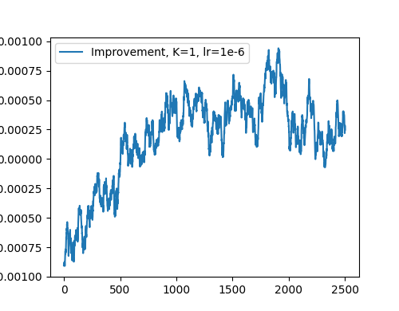

# Finetuning a Natural Language Generation Model Using Feedback

## Overview

This project aims to improve the performance of a natural language generation model by finetuning it using feedback as in [1]-[3]. 
The main objective of the project is to imporve the understanding on the methods by reproducing the resutls (performance improvement) in [1]-[3].  
Furthermore, project's aims are to check 1) whether the learning from feedback works in other models and datasets 2) check the stability of the PPO and 3) explore the limitations and possibility.

Instead of human feedback, the feedback from the pretrained classifier has been used to improve the generation model.
To this end, two types of data are used: classified feedback data (data_cls) and generated text data (data_nlg).
The project includes three Python scripts: train_cls.py, train_nlg.py, and finetuning_nlg.py. The reinforcement learning algorithm PPO (Proximal Policy Optimization) is used for finetuning the model.
The 


## Data

The `data_cls` directory contains classified feedback data. This data includes examples of both positive and negative feedback for generated text. The data is used to train a classification model that can classify feedback as positive or negative.

The `data_nlg` directory contains generated text data. This data is used to train the natural language generation model. 

## Scripts

### train_cls.py

The `train_cls.py` script trains a classification model using the classified feedback data in the `data_cls` directory. The model is trained to classify feedback as positive or negative. The resulting model is saved to a file for use in the `finetuning_nlg.py` script.

### train_nlg.py

The `train_nlg.py` script trains the natural language generation model using the generated text data in the `data_nlg` directory. The resulting model is saved to a file for use in the `finetuning_nlg.py` script.

### finetuning_nlg.py

The `finetuning_nlg.py` script finetunes the natural language generation model using the feedback data and PPO. The script generates text and receives feedback from the user. The feedback is used to calculate a reward, and PPO is used to update the model's policy to maximize the reward. 

## Usage

To use the project, first clone the repository. Then, install the required Python packages using pip:

```
pip install -r requirements.txt
```

Next, train the classification model using the `train_cls.py` script:

```
python train_cls.py
```

Train the natural language generation 
model using the `train_nlg.py` script:

```
python train_nlg.py
```

Finally, finetune the natural language generation model using the 
`finetuning_nlg.py` script:

```
python finetuning_nlg.py
```

The resulting finetuned model can be used to generate text.

## Results
We score the ethicity of text using the trained model. As the score has variance, use use moving average. Furthermore, to estimate the ethics score improvement, we substitude the ethics score without finetuning.
The improvement is plotted as follows.


More results and explanations are in `Analysis.ipynb` file.


## References
[1] Ziegler, Daniel M., et al. "Fine-tuning language models from human preferences." arXiv preprint arXiv:1909.08593 (2019).

[2] Stiennon, Nisan, et al. "Learning to summarize with human feedback." Advances in Neural Information Processing Systems 33 (2020): 3008-3021.

[3] https://github.com/openai/lm-human-preferences